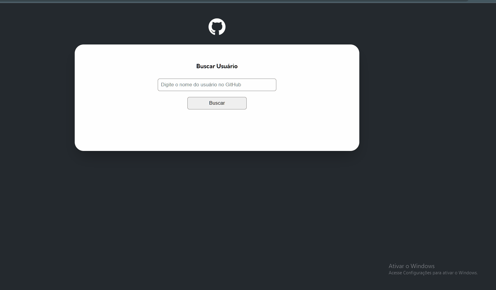

<h1> Projeto User Github </h1>

 
 
   

        O projeto tem como objetivo fazer requisições da API do GitHub para exibir dados de usuários que forem buscados. Ele foi pensado para praticar metodologias de HTML/CSS, mas principalmente o uso de Javascript para integrações com API. 
   

 

- O que foi aprendido com este projeto:

   * Manipulação do DOM;
   * Eventos com KeyUP para a tecla Enter ativar o botao de busca;
   * HTML semântico;
   * FlexBox;
   * Uso do fetch JS;
   * Integrações com API
   * Manipulação de objetos JS

 

---

<h2 align="center">Preview 🖥️</h2>

 

   

      
   

 

  <h2> Veja o projeto em funcionamento: __ <a href="https://italo-maia.github.io/users-api-github/" target="_blank">AQUI 🖱 </a> 🌍</h2>

---

 
 
 

### Este projeto foi desenvolvido com ❤️ por **[@Italo Maia](https://www.linkedin.com/in/italo-barbosa-maia-8b98b822a/)**, com incentivo da ecola de programação online **DEV QUEST** 🧡.  

